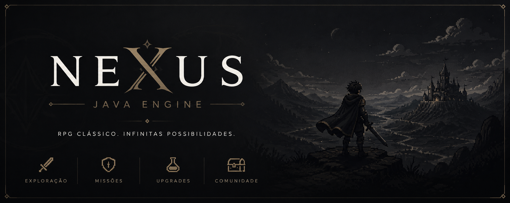

<div align="center">

<p align="center">
  
</p>

# ⚡ NEXUS JAVA ENGINE
### *A Lightweight Entity-Component-System (ECS) & Event-Driven Game Core*

[](https://www.oracle.com/java/)
[](https://github.com/viniciosdv/GameEngineJAVA)
[](LICENSE)
[]()

*Um motor de jogos modular construído do zero em Java puro, focado em alta performance, desacoplamento arquitetural e reatividade.*

</div>

---

## 🌟 O Propósito do Projeto
O **Nexus Engine** nasceu com o objetivo de desmistificar como os motores de jogos modernos funcionam por baixo do capô. Em vez de acoplar lógica e dados em estruturas rígidas de Orientação a Objetos tradicional, esta engine implementa o padrão **ECS (Entity-Component-System)** combinado com um **Event Bus reativo**, garantindo escalabilidade extrema e facilidade para adicionar novas mecânicas de gameplay.

---

## 🏛️ Arquitetura e Padrões de Projeto

O motor é dividido em três pilares fundamentais da engenharia de software para games:

| Módulo / Padrão | Responsabilidade Principal |
| :--- | :--- |
| **Entities (`EntityManager`)** | IDs numéricos leves (`long`) que servem apenas como "chaves" identificadoras no mundo do jogo. |
| **Components (`Data`)** | Contêineres de dados puros e burros (ex: `HealthComponent`, `StatsComponent`) sem nenhuma lógica de execução. |
| **Systems (`Logic`)** | Processadores de lógica pura (ex: `CombatSystem`) que varrem entidades que possuem determinados componentes e aplicam regras. |
| **Event Bus (`Reactive`)** | Desacopla sistemas através de um barramento de mensagens publish-subscribe assíncrono/síncrono. |

---

## 📂 Estrutura de Diretórios

```text
GameEngineJAVA/
│
└── com/engine/core/
    ├── Main.java              # Ponto de entrada (Bootstrap da aplicação)
    ├── GameEngine.java        # Orquestrador central e loop de inicialização
    ├── EntityManager.java     # Banco de dados em memória para Entidades/Componentes
    ├── EventBus.java          # Sistema central de despacho de eventos reativos
    │
    ├── components/            # [DADOS PUROS]
    │   ├── Component.java     # Interface de marcação base
    │   ├── HealthComponent.java # Gerenciamento de HP e estado vital
    │   └── StatsComponent.java  # Atributos de combate (Nome, Power)
    │
    └── systems/               # [LÓGICA E EVENTOS]
        ├── CombatSystem.java    # Processamento de dano e colisões lógicas
        └── EntityDiedEvent.java # Contrato de evento disparado em óbitos
